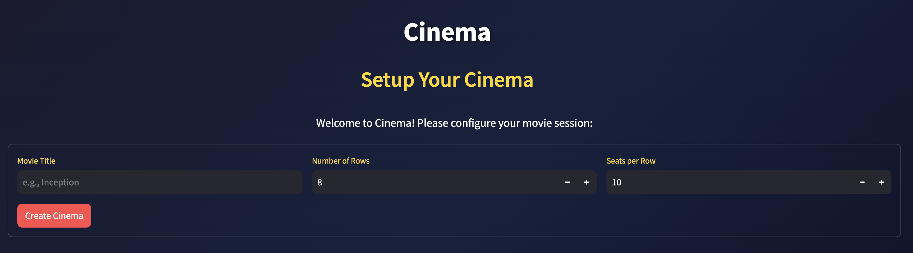
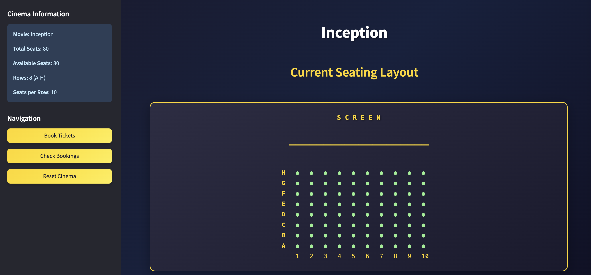
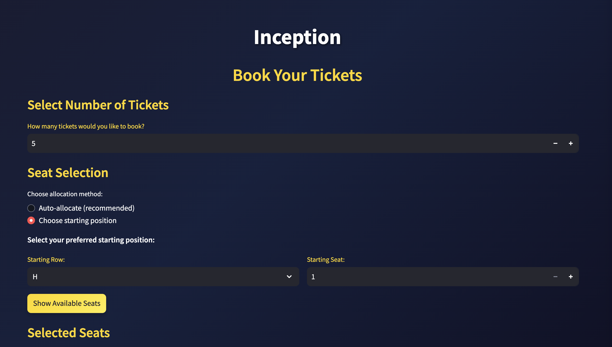

# Cinema Booking System

A comprehensive cinema booking system featuring both a modern web interface and command-line application. Book tickets with smart seat allocation, interactive seating maps, and streamlined booking management - perfect for cinema operators and movie enthusiasts alike.

> Semi-inspired by a take-home assignment some time ago. 

## Features

1. **Cinema Configuration**: Set up a movie screening with customizable seating layouts.
2. **Smart Seat Allocation**: Automatic seat selection based on optimal viewing positions.
3. **Custom Seat Selection**: Override default allocations by selecting specific starting positions.
4. **Multiple Seat Changes**: Change seat selections multiple times before confirming a booking.
5. **Booking Management**: View booking details using unique booking ids.
6. **Visualization**: Clear visual representation of the seating chart with screen orientation.

## Project Structure

```
booking/
├── cinema.py         # Core Cinema class implementation
├── main.py           # Main CLI application and UI logic
├── app.py            # Streamlit web UI application
├── styles.css        # CSS styling for web interface
├── requirements.txt  # Python dependencies
├── run_tests.py      # Test runner script
├── screenshots/      # Application screenshots
└── tests/            # Test suite
    ├── unit_tests/   # Unit tests for Cinema class
    └── e2e_tests/    # End-to-end tests for booking flows
```

## Requirements

- Python 3.6 or higher
- Dependencies listed in requirements.txt

## Setup

1. **Install Dependencies**:
```bash
pip install -r requirements.txt
```

2. **Optional: Create Virtual Environment** (recommended):
```bash
# Create and activate a virtual environment
python -m venv .venv

# On Windows:
.venv\Scripts\activate
# On macOS/Linux:
source .venv/bin/activate

# Then install dependencies
pip install -r requirements.txt
```

## Running the Application

### Web Interface (Streamlit) - Recommended

Launch the modern web interface with:

```bash
streamlit run app.py
```

This will open your browser to `http://localhost:8501` with a full-featured web interface including:

- **Interactive Setup**: Easy cinema configuration with form inputs
- **Visual Seating Map**: Real-time seating chart with color-coded seats
- **Modern UI**: Clean, responsive design with navigation sidebar
- **Smart Booking**: Auto-allocation and custom position selection
- **Booking Management**: View all bookings in a table format with search/filter
- **Live Updates**: Real-time seat availability and booking confirmations

### Screenshots

**Cinema Setup**


**Main Dashboard**


**Ticket Booking Interface**


### Command Line Interface

Launch the original CLI application with:

```bash
python main.py
```

### CLI Usage Instructions

#### Cinema Setup

When the application starts, you'll be prompted to define the movie and seating layout:
```
Please define movie title and seating map in [Title] [Row] [SeatsPerRow] format:
> Inception 8 10
```

This creates a cinema with 8 rows (A-H) and 10 seats per row for the movie "Inception".

Constraints:
- Maximum 26 rows (A-Z)
- Maximum 50 seats per row

#### Main Menu

After setup, you'll have three options:
```
Welcome to Cinemas
[1] Book tickets for Inception (80 seats available)
[2] Check bookings
[3] Exit
Please enter your selection:
```

#### Booking Workflow

1. Enter the number of tickets you want to book.
2. The system will suggest an optimal seating arrangement.
3. You can:
   - Accept the suggested seats by pressing Enter
   - Enter a new starting position (e.g., "B5") to select different seats

#### Seating Chart Explanation

```
         S C R E E N
--------------------------
C .  .  .  .  .  .  .  .  .  .
B .  .  #  #  #  #  .  .  .  .
A .  .  o  o  o  o  .  .  .  .
  1  2  3  4  5  6  7  8  9  10
```

- `.` = Available seats
- `o` = Currently selected seats
- `#` = Seats booked by others
- Rows are labeled from A (front) to Z (back)
- Seats are numbered from 1 to N (left to right)

#### Seat Allocation Rules

1. **Default Allocation**:
   - Starts from the back row, middle seats
   - Expands outward (alternating between right and left)
   - When a row is filled, allocation continues in the next row closer to the screen

2. **Position-Based Allocation**:
   - Starts from the specified position
   - Fills to the right in the current row
   - When overflow occurs, follows the default allocation pattern from the middle

## Running Tests

```bash
# Run all tests
python run_tests.py

# Run specific test modules
python -m unittest tests.unit_tests.test_cinema
python -m unittest tests.e2e_tests.test_booking_flow
```

### Test Suites

1. **Unit Tests**: Focus on the Cinema class functionality:
2. **End-to-End Tests**: Simulate real user interactions:
